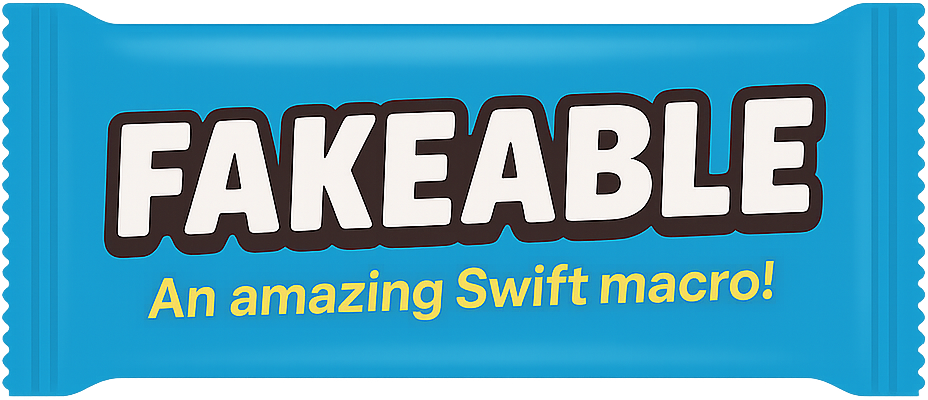

<p align="center">
  
</p>
<br>

The **Fakeable** macro is designed to simplify writing tests by automatically generating fake instances of your Swift types (structs, classes, and enums). By using this macro during testing, you can quickly obtain test objects with default or random values for all their properties, reducing boilerplate code and speeding up your test writing process.

## Overview

The Fakeable macro automatically generates a static `fake` method on your types. This method creates an instance of the type with generated values, which can be used in your tests. Its primary purpose is to simplify test setup by providing a quick way to obtain valid (or randomized) objects for testing.

## Installation

1. **Integrate via Swift Package Manager:**  
   Add the following dependency in your `Package.swift`:
   ```swift
   dependencies: [
     .package(url: "https://github.com/ThomasDutartre/Fakeable.git", from: "1.0.0")
   ]
   ```
   Then, add `"Fakeable"` as a dependency in your target.
   ```swift
   .product(name: "Fakeable", package: "swift-fakeable"),
   ```

2. **Import the Module:**  
   In your test code, import the Fakeable module:
   ```swift
   import Fakeable
   ```

## Usage

Annotate your types with the `@Fakeable` macro to enable fake instance generation. For example:

```swift
import Fakeable

@Fakeable
struct Address {
    let street: String
    let city: String?
    let zipCode: Int?
    let date: Date
}
```

Once the macro is applied, a `static func fake() -> User` method is automatically generated. 
```swift
#if DEBUG
static func fake(
    street: String = UUID().uuidString,
    city: String? = UUID().uuidString,
    zipCode: Int? = Int.random(in: -1000 ... 1000),
    date: Date = Calendar.current.date(from: DateComponents(year: Int.random(in: 1970 ... 2030), month: Int.random(in: 1 ... 12), day: Int.random(in: 1 ... 28)))!
) -> Address {
    return Address(
        street: street,
        city: city,
        zipCode: zipCode,
        date: date
    )
}
#endif
```

In your tests, you can simply create a fake instance with:

```swift
let fakeAddress = Address.fake()
let fakeAddressWithCustomParameters = Address.fake(city: nil, zipCode: 5030)
```

This makes it much easier to set up tests without manually initializing each property.

## Macro Parameters

The macro supports the following parameters:

- `collectionCount`: The number of elements to generate for collections. Default value: `5`.
- `behindPreprocessorFlag`: A string flag that wraps the generated code in a preprocessor directive. Default value: `DEBUG`.

These parameters allow fine-tuning of the macro's behavior to better fit your testing needs.

## Supported Types

The macro supports a variety of types for generating fake data. Specifically, it supports:

- **Primitive Types:**  
  - `String`
  - `Int`
  - `Double`
  - `Float`
  - `Decimal`
  - `Bool`
  - `Date`
  - `URL`
  
- **Additional Types:**  
  - `NSString`
  - Unsigned integers (`UInt`, `UInt8`, `UInt16`, `UInt32`, `UInt64`)
  - `CGFloat`
  - `NSDate`
  - `UUID`
  - `Data` (and `NSData`)
  - `TimeInterval`
  - `IndexPath`
  - `IndexSet`
  - `Locale`
  - `Measurement<UnitLength>`
  - `NSNumber`

These types are handled by the internal `Randomiser` logic, which defines a default random value for each type.

Furthermore, the macro supports:
- **Collections:** Arrays, dictionaries, and tuples are supported.
- **Objects:** Custom types can be supported as well—provided they are annotated with `@Fakeable`. This means you can nest fakeable objects within your types.

> **Note:** Nested arrays (arrays within arrays) are not yet supported. This might be added in a future update.

## Contributing

Contributions are welcome! Please submit issues or pull requests if you have suggestions for improvements or encounter bugs.

## License

This project is licensed under the MIT License. See the [LICENSE](LICENSE) file for details.
